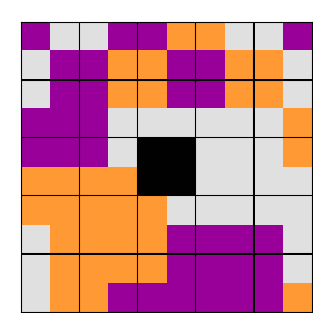

# NittyGrittySolver

This project solves the game Nitty Gritty. According the BoardGameGeek, in NittyGritty, "twenty-four square tiles are to be placed in a 5x5 tray (the center square is not playable)... each tile is a 2x2 square array of one of three colors - each permutation, ignoring rotation, is represented once among the tiles." link [here](https://boardgamegeek.com/boardgame/53748/nitty-gritty). The tiles must be placed so that the colors of adjacent colors match.

The file `main.py` solves the puzzle according to the following algorithm:

- Number the tile locations on the board 1-24, starting in the upper left-hand corner and numbering sequentially.
- Consider each unique starting tile and rotation, and consider boards where these are the first tiles.
- For each of these starting boards, make new potential boards by placing every possible tile in the second spot.
- Check which tiles create a color conflict and discard these potential boards.
- Keep the remaining potential boards, and move on to place all possible third tiles.
- Continue in this manner until all tiles are placed or no valid boards remain.

The file `plotBoard.py` takes the already computed solutions, located in the folder NittyGrittySolutionFiles, and chooses a random solution board to generate. An example of one of these solutions is shown below:

As there are many possible solutions, the main file takes a nontrivial time to run to completion. The code ran for about two weeks on my machine, which has an 8-core processor and 32GB of memory.